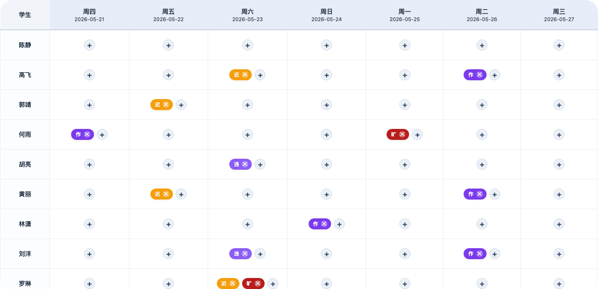
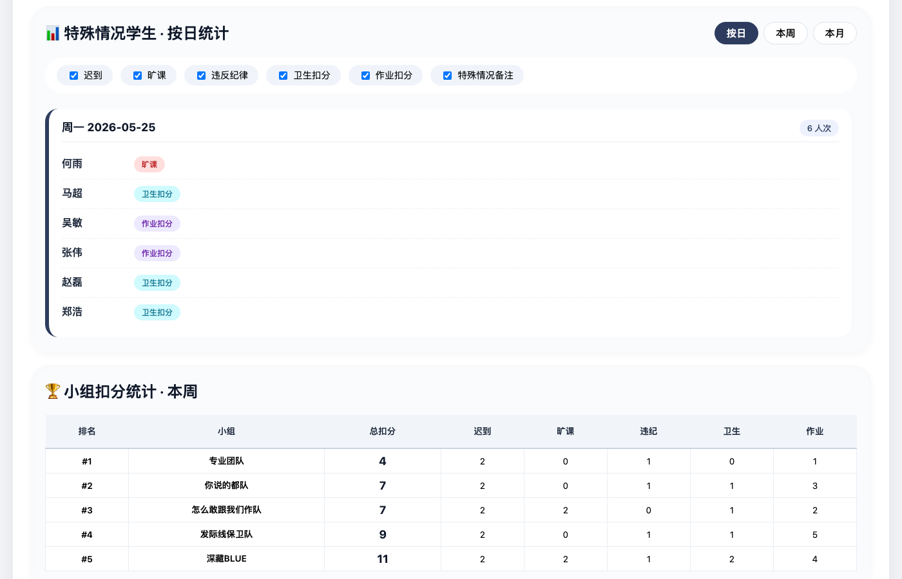
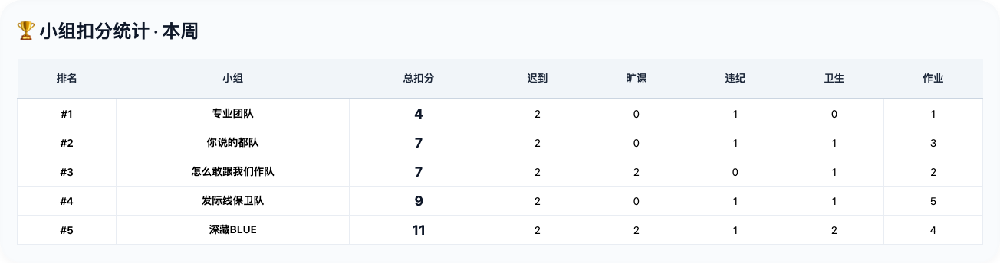
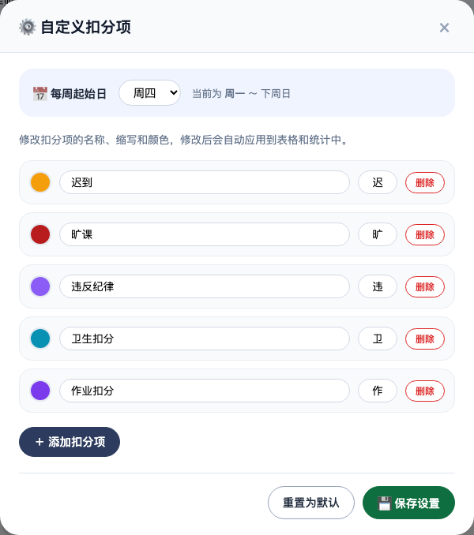

# 📋 班级周度管理系统

一个单 HTML 文件的班级日常管理工具，无需安装任何软件，打开浏览器即可使用。

[📦 GitHub 仓库](https://github.com/Asteriya-PhD/class-manager) | [🚀 在线使用](https://asteriya-phd.github.io/class-manager/)

## 截图

| 周度记录主界面 | 统计看板 |
|---|---|
|  |  |
| **小组扣分排名** | **自定义扣分项** |
|  |  |

## 功能

- **周视图记录** — 按周记录学生的迟到、旷课、违纪、卫生扣分、作业扣分等情况
- **自定义扣分项** — 名称、颜色、缩写均可自由增删改
- **周起始日可配置** — 周一～周日任选一天作为每周起始
- **Excel 导入** — 导入学生名单，第二列标注组名即可自动分组
- **统计看板** — 按日 / 本周 / 本月三档查看特殊情况学生
- **小组扣分排名** — 按小组汇总周扣分，从少到多排序
- **自动保存** — 数据实时存入浏览器 localStorage，刷新不丢失
- **历史快照** — 手动存档，可随时回溯
- **导出 CSV** — 导出周记录和统计数据
- **移动端适配** — 手机、小平板均可正常使用，表格支持横向滑动

## 使用

### 在线使用（推荐）
打开 [asteriya-phd.github.io/class-manager](https://asteriya-phd.github.io/class-manager/) 即可。

### 离线使用
下载 `index.html` 用浏览器打开即可，所有数据保存在浏览器本地，无需网络。

## 导入学生名单

支持 `.xlsx` / `.xls` / `.csv` 格式，格式要求：

| 姓名 | 组名（可选） |
|------|------------|
| 张三 | 第一组 |
| 李四 | 第二组 |

第一列为学生姓名，第二列为所属小组（不填则归为"未分组"）。

## 技术栈

- Vue 2.7（CDN）
- SheetJS（Excel 解析）
- 纯 CSS，无 UI 框架
- 单 HTML 文件，零依赖
